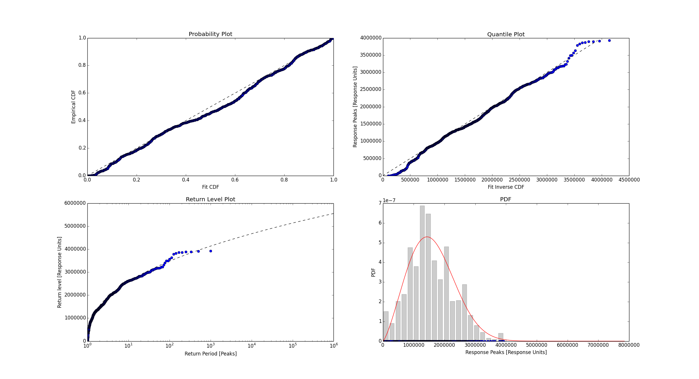
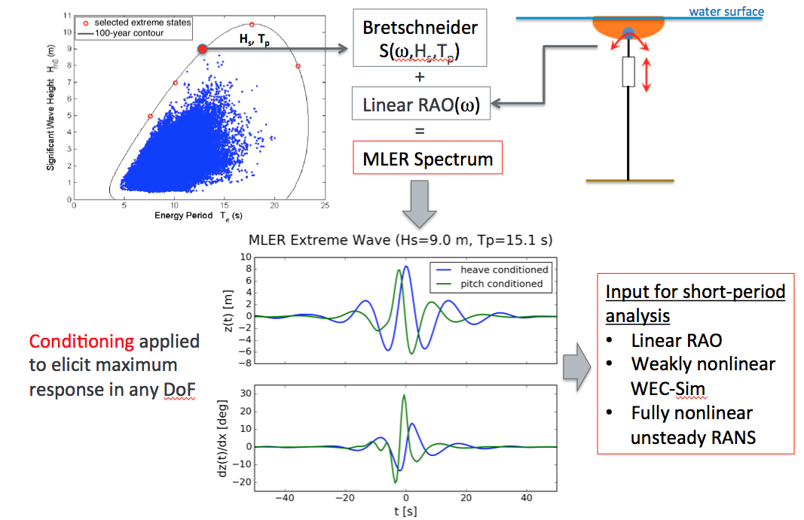

Examples
=========
This page includes a number of examples demonstrating the usage of the `WDRT`. In addtion to code snippets included here, these examples are outlined in the ``$WDRT_SOURCE/examples`` directory. Each toolbox module has at least one example/tutorial. The table of contents below gives an outline of the available tutorials.

.. contents::
   :depth: 4


Environmental characterization
------------------------------
The WDRT includes a package for creating environmental contours of extreme sea states using a `principle components analysis (PCA) <https://en.wikipedia.org/wiki/Principal_component_analysis>`_ methodology with additional improvements for characterizing the joint probability distribution of sea state variables of interest.
Environmental contours describing extreme sea states can be used for numerical or physical model simulations analyzing the design-response of WECs.
These environmental contours, characterized by combinations of significant wave height (:math:`H_s`) and either energy period (:math:`T_e`) or peak period (:math:`T_p`), provide inputs that are associated with a certain reliability interval.
These reliability levels are needed to drive both contour and full sea state style long-term extreme response analyses.

For this example (``$WDRT_SOURCE/examples/example_shortTermExtreme.py``), we will consider `NDBC buoy 46022 <http://www.ndbc.noaa.gov/station_page.php?station=46022>`_.

.. figure::  ../_static/example_envSampling.png
   :align: center
   :width: 400pt

   Environmental characterization with NDBC data, 100-year return contour, full sea state samples and contour samples

.. code-block:: python

	import numpy as np
	import WDRT.NDBCdata as NDBCdata
	import WDRT.ESSC as ESSC
	import os
	import matplotlib.pyplot as plt
	import h5py
	import copy


	# Pull spectral data from NDBC website
	swdList, freqList, dateVals = NDBCdata.fetchFromWeb(46022, savePath='data')

	# # Load data from existing text files
	# swdList, freqList, dateVals = NDBCdata.loadFromText(
	#     os.path.join('data', 'NDBC46022'))

	# Run stats and remove NaNs
	Hs, T, DateNum = NDBCdata.prepData(swdList, freqList, dateVals)

	# Declare required parameters
	depth = 391.4  # Depth at measurement point (m)
	size_bin = 250.  # Enter chosen bin size
	nb_steps = 1000.  # Enter discretization of the circle in the normal space
	# used for inverse FORM calculation
	Time_SS = 1.  # Sea state duration (hrs)
	Time_r = np.array([100])  # Return periods (yrs) of interest
	SteepMax = 0.07  # Optional: enter estimate of breaking steepness

	# Contour generation example
	Hs_Return, T_Return, _, _, _, _, _ = ESSC.getContours(Hs, T, depth, size_bin,
	                                                      nb_steps, Time_SS, Time_r)
	# Sample Generation Example
	num_contour_points = 20  # Number of points to be sampled for each
	# contour interval.
	contour_probs = 10 ** (-1 * np.array([1, 2, 2.5, 3, 3.5, 4, 4.5, 5, 5.5, 6]))
	# Probabilities defining sampling contour bounds.
	random_seed = 2  # Random seed for sample generation

	# Get samples for a full sea state long term analysis
	Hs_sampleFSS, T_sampleFSS, Weight_sampleFSS = ESSC.getSamples(Hs, T, num_contour_points,
	                                                     contour_probs, random_seed,
	                                                     depth, size_bin, nb_steps,
	                                                     Time_SS, Time_r)

	# Get samples for a contour approach long term analysis
	T_sampleCA = np.arange(12, 26, 2)
	Hs_sampleCA = ESSC.getContourPoints(T_Return, Hs_Return, T_sampleCA)

	# Modify contour by steepness curve if they intersect
	T_vals = np.arange(0.1, np.amax(T), 0.1)
	SteepH = ESSC.steepness(depth, SteepMax, T_vals)
	SteepH_Return = ESSC.steepness(depth, SteepMax, T_Return)
	Steep_correction = np.where(SteepH_Return < Hs_Return)
	Hs_Return_Steep = copy.deepcopy(Hs_Return)
	Hs_Return_Steep[Steep_correction] = SteepH_Return[Steep_correction]

	# Save data for future use
	with h5py.File('data/envSamples_NDBC46022.h5', 'w') as f:

	    # NDBC data
	    f_Hs = f.create_dataset('Hs', data=Hs)
	    f_Hs.attrs['units'] = 'm'
	    f_Hs.attrs['description'] = 'significant wave height'
	    f_T = f.create_dataset('T', data=T)
	    f_T.attrs['units'] = 'm'
	    f_T.attrs['description'] = 'energy period'

	    # Return contours
	    f_T_Return = f.create_dataset('T_Return', data=T_Return)
	    f_T_Return.attrs['units'] = 's'
	    f_T_Return.attrs['description'] = 'contour, energy period'
	    f_Hs_Return = f.create_dataset('Hs_Return', data=Hs_Return)
	    f_Hs_Return.attrs['units'] = 'm'
	    f_Hs_Return.attrs['description'] = 'contours, significant wave height'
	    f_Hs_Return_Steep = f.create_dataset(
	        'Hs_Return_Steep', data=Hs_Return_Steep)
	    f_Hs_Return_Steep.attrs['units'] = 'm'
	    f_Hs_Return_Steep.attrs['description'] = 'contours (steepness limited), significant wave height'

	    # Samples for full sea state long term analysis
	    f_Hs_sampleFSS = f.create_dataset('Hs_sampleFSS', data=Hs_sampleFSS)
	    f_Hs_sampleFSS.attrs['units'] = 'm'
	    f_Hs_sampleFSS.attrs['description'] = 'full sea state significant wave height samples'
	    f_T_sampleFSS = f.create_dataset('T_sampleFSS', data=T_sampleFSS)
	    f_T_sampleFSS.attrs['units'] = 's'
	    f_T_sampleFSS.attrs['description'] = 'full sea state energy period samples'
	    f_Weight_sampleFSS = f.create_dataset('Weight_sampleFSS', data=Weight_sampleFSS)
	    f_Weight_sampleFSS.attrs['description'] = 'full sea state relative weighting samples'

	    # Samples for contour approach long term analysis
	    f_Hs_sampleCA = f.create_dataset('Hs_sampleCA', data=Hs_sampleCA)
	    f_Hs_sampleCA.attrs['units'] = 'm'
	    f_Hs_sampleCA.attrs['description'] = 'contour approach significant wave height samples'
	    f_T_sampleCA = f.create_dataset('T_sampleCA', data=T_sampleCA)
	    f_T_sampleCA.attrs['units'] = 's'
	    f_T_sampleCA.attrs['description'] = 'contour approach energy period samples'

	# Plot data
	plt.figure()
	plt.plot(T, Hs, 'bo', alpha=0.1, label='NDBC data')
	plt.plot(T_Return, Hs_Return, 'k-', label='100 year contour')
	plt.plot(T_Return, Hs_Return_Steep, '-', color='0.65',
	         label='100 year contour w/ breaking')
	plt.plot(T_sampleFSS, Hs_sampleFSS, 'ro', label='full sea state samples')
	plt.plot(T_sampleCA, Hs_sampleCA, 'y^', label='contour approach samples')
	plt.legend(loc='lower right', fontsize='small')
	plt.grid(True)
	plt.xlabel('Energy period, $T_e$ [s]')
	plt.ylabel('Sig. wave height, $H_s$ [m]')
	plt.show()


Short-term extreme response analysis
------------------------------------
A short term extreme distribution is the answer to “If a device is in sea-state X for Y amount of time, what will be the largest Z observed?", where X is the environmental condition, Y the short-term period, and Z the response parameter of interest (e.g. the mooring load, bending moment).
The short-term extreme response module provides five different methods for obtaining this distribution based on observations of the quantity of interest "Z" at the desired sea-state "X".
These methods are described in detail in :ref:`Michelen and Coe 2015 <pubs>`

In this example the Weibull tail-fit method is used.
The proccess of obtaiing the sort-term extreme distribution using the Weibull tail-fit method is as follows:

	1. Identify the peaks from a time-series of any length of the response "Z" of the WEC in the sea-state of interest "X". 
	Some minimum time length is required to achieve convergence.

	2. Order the peaks in ascending order and approximate the empirical peak distribution as:

	.. math::

		F^{\prime}(x_i) = \frac{i}{N+1}

	where :math:`x_i` is the :math:`i^{\textrm{th}}`-ordered peak

	3. Fit Weibull distributions to seven subsets of the points (:math:`x_i`, :math:`F^{\prime}(x_i)`) corresponding to :math:`F^{\prime}(x_i) > \left(0.95, 0.90, 0.85, 0.80, 0.75, 0.70, 0.65 \right)`.

	4. The distribution of the global peaks is then approximated as a Weibull distribution with parameters equal to the average of the parameters of the seven fitted Weibull distributions.

	5. The short term extreme distribution (:math:`F_e(x)`) is then obtained from the peaks distribution (:math:`F_p(x)`) as

	.. math::

		F_e(x) = F_p(x)^q
		
	where :math:`q` is the number of expected peaks in the short-term period.

In this example we start with a time-series of the quantity of interest at the desired sea-state. 
The global peaks are then identified.

.. figure::  ../_static/ste_peaks.png
   :align: center
   :width: 600pt

The desired short-term period is 1 hour.
The 1-hour extreme distribution is estimated using the Weibull tail fit as described above.

.. figure::  ../_static/ste_distributions.png
   :align: center
   :width: 600pt

The goodness of fit plots are shown as a visual check. 
They show the quality of the agreement between the global peaks and the resulting Weibull tail fit.



This example is shown below and can found in ``$WDRT_SOURCE/examples/example_shortTermExtreme.py``.

.. code-block:: python

	import numpy as np
	import matplotlib.pyplot as plt
	import WDRT.shortTermExtreme as ecm
	import WDRT.fatigue as fatigue

	# load response time series
	data = ecm.loadtxt('data/data.csv',delimiter=',')
	t = data['t']
	response = data['data']

	# find global peaks
	t_peaks, peaks = ecm.globalPeaks(t, response)

	# plot
	plt.figure()
	plt.hold(True)
	plt.plot(t, response, 'k-')
	plt.plot(t_peaks, peaks, 'go')
	plt.plot([0, t[-1]], [0, 0], 'k--')
	plt.xlabel('Time, $t$ [s]')
	plt.ylabel('Response, $x$')
	plt.grid(True)
	plt.ticklabel_format(style='sci', axis='y', scilimits=(0, 0))

	# get the 1-hour extreme distribution using the Weibull tail fit method
	x_e = np.linspace(0, 2 * np.max(peaks), 10000)
	t_x = (t[-1] - t[0])
	t_st = 1. * 60. * 60.
	stextreme_dist, peaks_dist, _, _, _ = ecm.extremeDistribution_WeibullTailFit(x=peaks, x_e=x_e, t_x=t_x, t_st=t_st)

	# plot
	plt.figure()
	ax = plt.subplot(2, 1, 1)
	plt.hold(True)
	plt.plot(x_e, peaks_dist.pdf(x_e), 'g-', label='Peak distribution')
	plt.plot(x_e, stextreme_dist.pdf(x_e), 'r-', label='Extreme distribution')
	xlim = ax.get_xlim()
	ylim = ax.get_ylim()
	plt.ylim([0, ylim[1]])
	plt.xlim([0, xlim[1]])
	plt.ylabel('$PDF(x)$')
	plt.ylabel('Response, $x$')
	plt.grid(True)
	plt.ticklabel_format(style='sci', axis='x', scilimits=(0, 0))
	plt.ticklabel_format(style='sci', axis='y', scilimits=(0, 0))
	plt.legend()

	ax = plt.subplot(2, 1, 2)
	plt.hold(True)
	plt.plot(x_e, peaks_dist.cdf(x_e), 'g-')
	plt.plot(x_e, stextreme_dist.cdf(x_e), 'r-')
	xlim = ax.get_xlim()
	ylim = ax.get_ylim()
	plt.ylim([0, ylim[1]])
	plt.xlim([0, xlim[1]])
	plt.xlabel('Response, $x$')
	plt.ylabel('$CDF(x)$')
	plt.grid(True)
	plt.ticklabel_format(style='sci', axis='x', scilimits=(0, 0))

	# goodness of fit plots
	gof_plots = ecm.goodnessOfFitPlots(data=peaks, prob_func=peaks_dist, np_return=1000001, x_pdf=x_e, bins_pdf=20)

	plt.show()


Long-term extreme response analysis
-----------------------------------
The long-term extreme response represents the design response for some specific deployment location and time-span.
Two major classes of approaches are implemented in the WDRT: the contour approach and the full sea state approach.

Contour approach
````````````````
In the contour approach, simulations are run along the desired extreme wave contour (e.g. 25-year contour).
The condition producing the largest response is used to define the extreme response distribution for the device via a short-term extreme process.
To obtain a single design response value for this method, one should select a percentile from that extreme response distribution based on some prior knowledge of system behavior.
Typical percentiles used for marine structures range from 75 to 99\%.

The following steps demonstrate the execution of a `contour approach` to long-term extreme response analysis.
These steps are also summarized in ``$WDRT_SOURCE/examples/example_contourApproach.py``.

.. figure::  ../_static/example_contourApproach.png
   :align: center
   :width: 400pt

   Environmental characterization with NDBC data, 100-year return contour, full sea state samples and contour samples.

1. Establish environmental data and sample sea stats
''''''''''''''''''''''''''''''''''''''''''''''''''''
Following the `Environmental characterization`_ example, a the environmental conditions at a site can be characterized then sampled to provide a set of sea states for modeling analysis.
For this example, we will work with the data produced in the `Environmental characterization`_ example.

.. code-block:: python

	import numpy as np
	import scipy.io
	import WDRT.ESSC as ESSC
	import matplotlib.pyplot as plt
	from mpl_toolkits.mplot3d import Axes3D
	import scipy.interpolate as interp
	import WDRT.longTermExtreme as lte
	import WDRT.shortTermExtreme as ste
	import h5py
	import os

	# Load data from example_envSampling.py
	envFile = h5py.File(os.path.join('data', 'envSamples_NDBC46022.h5'), 'r')
	Hs = np.array(envFile['Hs'])
	T = np.array(envFile['T'])
	Hs_Return = np.array(envFile['Hs_Return'])
	T_Return = np.array(envFile['T_Return'])
	Hs_sample = np.array(envFile['Hs_sampleCA'])
	T_sample = np.array(envFile['T_sampleCA'])

2. Model device response
''''''''''''''''''''''''
Obtain predictions for your device response at each of the selected sea states.
This step can be accomplished via any model considered appropriate.
Low and mid-fidelity numerical models (e.g. Cummins equation) are often used.
However, experimental testing could be used as well.
Whatever the approach, the process must supply sufficient time histories of the relevant responses at each of the selected sea states.
For this example, we will simply load data that was previously produced with a simple Cummins equation model.

.. code-block:: python

	modResFile = h5py.File(os.path.join(
	    'data', 'longTerm_contourApproach.h5'), 'r')
	t = np.array(modResFile['time'])
	tSim = t[-1]
	n = len(modResFile['x'])
	peaks = []
	mmax = []
	x = []
	for ii in range(n):
	    ss = 'ss_%03d' % ii
	    x.append(np.array(modResFile['/x/' + ss]))
	    peaks.append(ste.globalPeaks(t, x[ii])[1])
	    mmax.append(np.max(peaks[ii]))

3. Short term extreme statistics 
''''''''''''''''''''''''''''''''
The extreme response for each sea state can be defined as a percentile, :math:`\alpha`, in the extreme response distributions. The percentile chosen here should ideally be based on some experience with similar systems. Typical values for :math:`\alpha` used for marine structures range from 75 to 99\%. This approach has less variability than simply picking the maximum QOI observed in each sea state.

.. code-block:: python

	tPer = 1 * 60 * 60  # storm period
	x_t = np.linspace(0, 1.5 * np.max(mmax), 100)
	edist = []
	ev = []
	r975 = []
	for ii in range(n):
	    edist.append(ste.extremeDistribution_WeibullTailFit(
	        x=peaks[ii], x_e=x_t, t_x=tSim, t_st=tPer)[0])
	    ev.append(edist[ii].getExpVal())

5. Determine design load condition(s) 
'''''''''''''''''''''''''''''''''''''
For the quantity of interest (QOI), find the sea state that represents the design load condition; this will be the design load condition (DLC) for that (QOI). The DLC is defined as the scenario that gives the largest response. To define the DLC by statistically-supported process, it is best to use a short-term extreme response analysis process to examine the QOI in each of the considered sea states.

.. code-block:: python

	mi = np.argmax(ev)
	x0 = edist[mi].getRthVal(0.00001)
	x1 = edist[mi].getRthVal(1 - 0.00001)
	x = np.linspace(x0, x1, 500)
	r95 = edist[mi].getRthVal(0.95)
	print 'design state (Hs, Te): (%.1f, %.1f)' % (Hs_sample[mi], T_sample[mi])
	print 'extreme value: %e' % (r95)

6. Plot the data
''''''''''''''''
The sea state data, contour results and the extreme distribution from the design load condition can be plotted for analysis.

.. code-block:: python

	plt.figure()
	plt.plot(T, Hs, 'bo', alpha=0.1, label='NDBC data')
	plt.plot(T_Return, Hs_Return, 'k-', label='100 year contour')
	plt.plot(T_sample, Hs_sample, 'y^', label='full sea state samples')
	plt.legend(loc='lower right', fontsize='small')
	plt.grid(True)
	plt.xlabel('Energy period, $T_e$ [s]')
	plt.ylabel('Sig. wave height, $H_s$ [m]')

	fig = plt.figure()
	ax = fig.add_subplot(111, projection='3d', autoscale_on=True)
	ax.plot(T_Return, Hs_Return, np.zeros_like(T_Return), 'k')
	ax.plot(T_sample, Hs_sample, np.zeros_like(Hs_sample), 'yo')
	for i in range(len(T_sample)):
	    ax.plot([T_sample[i], T_sample[i]], [Hs_sample[i], Hs_sample[i]], [0, ev[i]],
	            '-', linewidth=2, color='b', alpha=.5)
	ax.plot(T_sample, Hs_sample, ev, '-o')
	ax.set_xlabel('Energy period, $T_e$ (s)')
	ax.set_ylabel('Sig. wave height, $H_s$ (m)')
	ax.set_zlabel('$x$')

	plt.figure()
	plt.plot(x, edist[mi].cdf(x))
	plt.plot(plt.xlim(), 0.95 * np.ones(2), 'r--')
	plt.plot(r95 * np.ones(2), plt.ylim(), 'r--')
	plt.grid(True)
	plt.xlabel('$x$')
	plt.ylabel('$CDF(x)$')

	plt.show()

Full sea-sate approach
``````````````````````
In the full sea state approach, simulations are run at a sampling of sea states within an envelop defined by the environmental characterization process.
Based on the device response and relative occurrence likelihood for each sea state, an extreme distribution is constructed.
The full sea-state approach is more rigorous than the contour approach, but also requires more modeling to implement.
This distribution gives a richer picture of the design response and can, for example, be used to study how the design response varies with return period.

The following example is also located at ``$WDRT_SOURCE/examples/example_longTermFullSeaState.py``.

1. Establish environmental data and sample sea stats
''''''''''''''''''''''''''''''''''''''''''''''''''''
Following the `Environmental characterization`_ example, a the environmental conditions at a site can be characterized then sampled to provide a set of sea states for modeling analysis.
For this example, we will work with the data produced in the `Environmental characterization`_ example.

.. code-block:: python

	import numpy as np
	import WDRT.shortTermExtreme as ste
	import WDRT.longTermExtreme as lte
	import matplotlib.pyplot as plt
	import h5py
	import os

	envFile = h5py.File(os.path.join('data', 'envSamples_NDBC46022.h5'), 'r')
	Hs_sample = np.array(envFile['Hs_sampleFSS'])
	T_sample = np.array(envFile['T_sampleFSS'])
	Weight_sample = np.array(envFile['Weight_sampleFSS'])
	Hs = np.array(envFile['Hs'])
	T = np.array(envFile['T'])
	Hs_Return = np.array(envFile['Hs_Return'])
	T_Return = np.array(envFile['T_Return'])

2. Model device response
''''''''''''''''''''''''
Obtain predictions for your device response at each of the selected sea states.
This step can be accomplished via any model considered appropriate.
Low and mid-fidelity numerical models (e.g. Cummins equation) are often used.
However, experimental testing could be used as well.
Whatever the approach, the process must supply sufficient time histories of the relevant responses at each of the selected sea states.
For this example, we will simply load data that was previously produced with a simple Cummins equation model.

.. code-block:: python

	modResFile = h5py.File(os.path.join('data', 'longTerm_FullSeaState.h5'), 'r')
	t = np.array(modResFile['time'])
	tSim = t[-1]
	n = len(modResFile['x'])
	peaks = []
	mmax = []
	x = []
	for ii in range(n):
	    ss = 'ss_%03d' % ii
	    x.append(np.array(modResFile['/x/' + ss]))
	    peaks.append(ste.globalPeaks(t, x[ii])[1])
	    mmax.append(np.max(peaks[ii]))

4. Short-term response distributions
''''''''''''''''''''''''''''''''''''
As discussed in the `Short-term extreme response analysis`_ example, the short-term extreme response corresponds to some assumed period of interest, often referred to as the storm period.
Typically 1 to 3 hour storms are considered.
Obtain the short-term extreme response distribution for the storm duration of interest, :math:`f_{x_{1\textrm{hr}}|H_s, T_e}(x)`.

.. code-block:: python

	tPer = 1 * 60 * 60  # storm period
	x_t = np.linspace(0, 1.5 * np.max(mmax), 100)
	edist = []
	ccdf = []
	for ii in range(n):
	    edist.append(ste.extremeDistribution_WeibullTailFit(
	        x=peaks[ii], x_e=x_t, t_x=tSim, t_st=tPer)[0])
	    ccdf.append(edist[ii].ccdf)

5. Construct long-term response distribution
''''''''''''''''''''''''''''''''''''''''''''
From the previous 4 steps, we now have :math:`n=100` pairs of sea state and corresponding device response probabilities.
The long-term extreme response distribution can be constructed as a complementary cumulative distribution function (CCDF), sometimes also called a survival function.
When plotted on a log-y scale, the CCDF has the benefit of highlighting the *tail* of the more typical cumulative distribution function (CDF).

.. math::

	\bar{F}_{LT}(x_T) 	&= f(x > x_T) \\
						&= \int{ \int{ \bar{F}_{x_{1\textrm{hr}}|H_s, T_e}(x_T) f_{H_s,T_e}(h, t) dh} dt}

.. code-block:: python

	LTS = lte.fullLongTermSurvival(Fr=ccdf, fs=Weight_sample)

6. Plot and analyze results
'''''''''''''''''''''''''''
The results can be plotted and used to determine the return level for a desired return period.

.. figure::  ../_static/example_longTermFullSeaState.png
   :align: center
   :width: 400pt

   Long term complementary cumulative distribution function (CCDF).

.. code-block:: python

	plt.figure().canvas.set_window_title('Sea state sampling')
	plt.plot(T, Hs, 'bo', alpha=0.25, label='data')
	plt.plot(T_sample, Hs_sample, 'ro', label='samples')
	plt.plot(T_Return, Hs_Return, label='100 year contour')
	plt.legend(loc='best')
	plt.grid(True)
	plt.xlabel('Energy period, $T_e$ [s]')
	plt.ylabel('Sig. wave height, $H_s$ [m]')

	plt.figure().canvas.set_window_title('Long-term response')
	plt.hold(True)
	plt.plot(x_t, LTS(x_t), 'k-', label='Full sea state survival')
	for ii in range(n):
	    if ii == 0:
	        plt.plot(x_t, ccdf[ii](x_t), 'r-', alpha=0.1, label='Individual sea state survivals')
	    else:
	        plt.plot(x_t, ccdf[ii](x_t), 'r-', alpha=0.1)
	plt.gca().set_yscale('log')
	plt.grid(True)
	yLs = [1, 5, 10, 25, 50, 100]
	for yL in yLs:
	    plt.plot(plt.xlim(), (1 / (yL * 365.25 * 24 * 1)) * np.ones(2), 'r--')
	    plt.text(plt.xlim()[0] + 0.05 * plt.xlim()[1],
	             (1 / (yL * 365.25 * 24 * 1)),
	             '%i-year return' % (yL), fontsize=10)
	plt.xlabel('$x$')
	plt.ylabel('$CCDF(x)$')
	plt.xlim((0, 30))
	plt.ylim((1e-1 / (yLs[-1] * 365.25 * 24 * 1), 1))
	plt.legend(loc='upper right')
	plt.show()

Fatigue analysis
----------------
In addition to extreme loads, a WEC must also be able to structurally withstand fatigue loading for its design life.
Fatigue loads are time varying loads which cause cumulative damage to structural components and eventually lead to structural failure.
Usually, a component’s fatigue strength/life is reported in terms of an :math:`S`-:math:`N` curve.
The :math:`S`-:math:`N` curve, which is typically obtained empirically, gives the number of load cycles :math:`N` to failure at constant load amplitude :math:`S`, as illustrated in the following figure.
Mathematically, the behavior is described as, :math:`\log (N) = \log (K – m) \log (S)`.
Where, :math:`S_{ult}`, is the ultimate strength; :math:`S_{end}`, is the endurance limit, below which, no failure occurs with constant amplitude loading; :math:`m` is the slope of the :math:`S`-:math:`N` curve; and, :math:`K` is an empirical material constant determining the level of the :math:`S`-:math:`N` curve.

.. figure::  ../_static/S-N.png
   :align: center
   :width: 300pt

WEC loads, however, are highly variable and by no means of constant amplitude.
The most common method used to predict the cumulative damage of variable loading is the Palmgren-Miner rule, as given below.
The Palmgren-Miner rule is based on the assumption that the cumulative damage of each load cycle is sequence independent, and thus the total damage equivalent load, :math:`S_{N}`, is obtained with a linear summation of the distributed load ranges.
:math:`S_{i}`, the load range for bin :math:`i`, and :math:`n_i`, the number of cycles in load range :math:`i`, are usually obtained via the rain-flow counting method.

.. math::

	S_N = \left(\sum{\frac{S^m_i n_i}{N}}\right)^{\frac{1}{m}}

The intended used of the fatigue module in the WDRT is as an early design stage WEC fatigue load estimator.
The required inputs to the module are:

	1. A force or stress history, which may be obtained either experimentally or via simulation. Pertinent loads may include, power-take-off (PTO) loads, mooring loads, bending moments, etc.

	2. The :math:`S`-:math:`N` curve slope, :math:`m`, which is likely unknown with any accuracy in the early stages of design, but as an initial estimate, the following ranges may be used: :math:`m \approx 3-4` for welded steel, :math:`m \approx 6-8` for cast iron, and :math:`m \approx 9-12` for composites.

	3. And, :math:`N`, the number of cycles expected in the WEC’s design life, which is up to the user to ascertain given a specified design life and environmental characterization.

This example is shown below and can found in ``$WDRT_SOURCE/examples/example_fatigue.py``::

	# This example loads pre-calculated PTO force histories for a reduced size joint
	# probability distribution. Then uses the WDRT fatigue function to calculate
	# equivalent fatigue loads for a 1 hour timeframe and a 1 year timeframe.

	import numpy as np
	import WDRT.fatigue as fatigue

	# Reduced size joint probability distribution
	Te = [[6.0,10.0,14.0],[6.0,10.0,14.0],[6.0,10.0,14.0]]  # Wave energy periods
	Hs = [[1.25,1.25,1.25],[2.75,2.75,2.75],[4.25,4.25,4.25]]   # Significant wave heights
	P = np.multiply([[23.45,24.78,1.64],[9.18,28.21,4.11],[0.05,5.00,2.34]],0.01)   # Probability

	N1h = 0
	N1y = 0
	[h,t] = np.shape(P)
	for i in range(h):
	    for j in range(t):
	        N1h = N1h+1*60*60*P[i][j]/(Te[i][j]*.82476)   # Average N in 1 hour (Tavg = 0.82476*Te)
	        N1y = N1y+1*365*24*60*60*P[i][j]/(Te[i][j]*.82476)   # Average N in 1 year
	        
	m = float(6)    # Assume an S-N curve slope of 6 (representative of cast iron)
	Feq_1h = np.zeros((h,t))
	Feq_1y = 0
	for i in range(h):
	    for j in range(t):
	        # Read pre-calculated PTO force histories for each sea state
	        Fpto = np.loadtxt('examples\data\FptoH'+str(int(Hs[i][j]))+'T'+str(int(Te[i][j]))+'.txt')	
	        Feq_1h[i][j] = fatigue.EqLoad(Fpto, N1h, m) # Equivalent fatigue load for a 1 hour timeframe
	        Feq_1y = Feq_1y+(Feq_1h[i][j]**m)*N1h*P[i][j]
	Feq_1y = (Feq_1y/N1y)**(1/m)	# Equivalent fatigue load for a 1 year timeframe

	print('1 hour equivalent fatigue loads:')
	print(Feq_1h)
	print('1 year equivalent fatigue load:')
	print(Feq_1y)

In this example, 1 hour PTO force histories (for the `RM3 WEC <http://wec-sim.github.io/WEC-Sim/tutorials.html#two-body-point-absorber-rm3>`_) have been numerically obtained (using `WEC-Sim <http://wec-sim.github.io/WEC-Sim/index.html>`_) for each sea state in the hypothetical joint probability distribution shown below.
The average number of cycles expected in 1 hour, :math:`N_{\textrm{1-hr}}`, and 1 year, :math:`N_{\textrm{1-yr}}`, timeframes are estimated from the joint probability distribution.
The :math:`S`-:math:`N` curve slope, :math:`m`, is set to 6.
Then, for each sea state, the force histories are read, and using the WDRT fatigue module, 1 hour damage equivalent loads are calculated, as given below.
And finally, the annual damage equivalent load is calculated by reapplying the Palmgren-Miner rule and taking advantage of the fact that the rainflow counts were already obtained in the 1 hour damage equivalent load computations, and only need to be adjusted and summed according to the probability of occurrence at each sea state.

.. figure::  ../_static/Feq.png
   :align: center
   :width: 400pt


Most-likely extreme response (MLER)
-----------------------------------

.. Note::

	Unlike the rest of `WDRT`, the Most-Likely Extreme Response (MLER) module of this toolbox is currently written in MATLAB; efforts are currently underway to port it to python.

The extreme load is often a matter of chance created by the instantaneous position of the device and a series of random waves. The occurrence of an extreme load should be studied as a stochastic event because of the nature of the irregular sea states. The extreme wave load can be predicted. The MLER toolbox were developed to generate a focused wave profile that gives the largest response with the consideration of wave statistics based on spectral analysis and the response amplitude operators (RAOs) of the device.

An example can be found in ``$WDRT_SOURCE/WDRT/MLER_toolbox/testrun.m``.

.. code-block:: matlab

	% create the object
	Test=MLERclass;

	% setup the simulation
	Test.sim.simSetup;

	% setup the waves
	Test.waves.H=9;
	Test.waves.T=15.1;
	Test.waves.numFreq=500;
	Test.waves.waveSetup;
	Test.waves.plotSpectrum;

	% setup the RAO information
	Test.RAOread(3,'RAO_data/RAO_heave_RM3float.dat');
	Test.RAOread(5,'RAO_data/RAO_pitch_RM3float.dat');
	Test.RAOplot(3);        % check the RAO
	Test.RAOplot(5);        % check the RAO

	% now that everything is setup, generate the MLER wave for heave.
	Test.MLERcoeffsGen(3,1);        % generate the wave profile, 1 meter response desired

	% at this point we can export the coefficients.  The coefficients will
	% match a desired response height that was given as the second argument to
	% MLERcoeffsGen.  But, if a specific height of the incoming wave is wanted,
	% we can renormalize the wave amplitude now
	Test.MLERwaveAmpNormalize(Test.waves.H /2  * 1.9)           % the peak height (peak to MSL) desired

	% now export the heave coefficients
	Test.MLERexportCoeffs('TestData/Test_heave_MLER_heaveOpt_Coeffs.txt');


	% export the wave amplitude time series at x=x0 for heave
	Test.MLERexportWaveAmpTime('TestData/Test_heave_MLER_heaveOpt_heave_WaveAmpTime.txt',3)

	% export the spectral info for WEC-Sim
	Test.MLERexportWECSim('TestData/Test_heave_MLER_heaveOpt_WECSimInput.txt')


	% make a movie of the sequence for heave
	MovieFramesHeave=Test.MLERanimate(3);
	% export movie of heave (don't add extension)
	Test.MLERexportMovie('Movie_Heave',MovieFramesHeave)


	% make a movie of the sequence for pitch
	MovieFramesPitch=Test.MLERanimate(5);
	% export movie of pitch (don't add extension)
	Test.MLERexportMovie('Movie_Pitch',MovieFramesPitch)


	% do some checks for heave vs. pitch optimized
	Test_heave.S = Test.S;

	Test.MLERcoeffsGen(5,1);
	Test_pitch.S = Test.S;


In this example, the MLER method was applied to model a floating ellipsoid (Quon et al. OMAE 2016). The waves were generated from the extreme wave statistics data and the linear RAOs were obtained from a simple radiation-and-diffraction-method-based numerical model known as the `Wave Energy Converter Simulator, or WEC- Sim <https://wec-sim.github.io/WEC-Sim/>`_. 

Figure below explains how the MLER waves were generated and used. For this particular example, the target sea state has a significant wave height of 9 m and energy period of 15.1 sec and was represented using Brettschneider spectrum. The focused wave was designed to target maximum pitch motion. Note that a specific wave profile is required for different response of interest (e.g., motion, mooring load, shear stress and bending moment). For example, the MLER wave profile for pitch is different from the one for heave. This is expected because the max heave and pitch are most likely to occur at different time.



